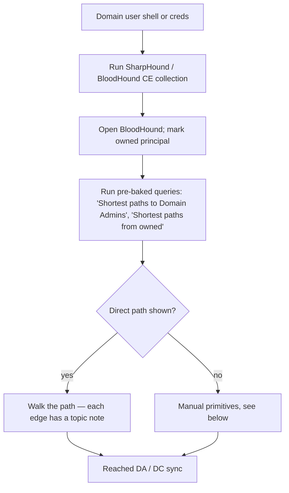
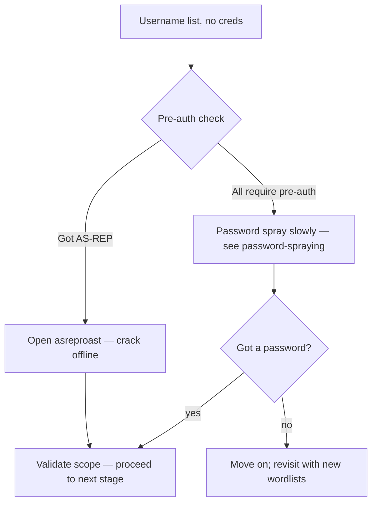
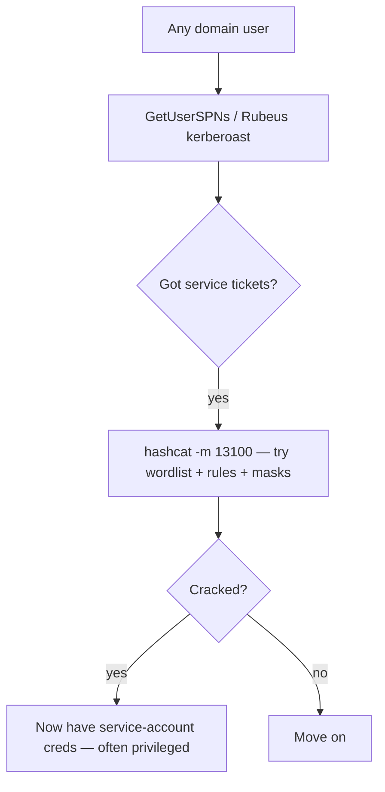
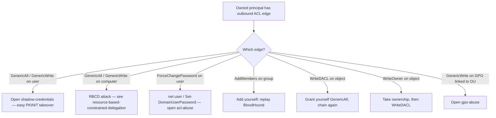
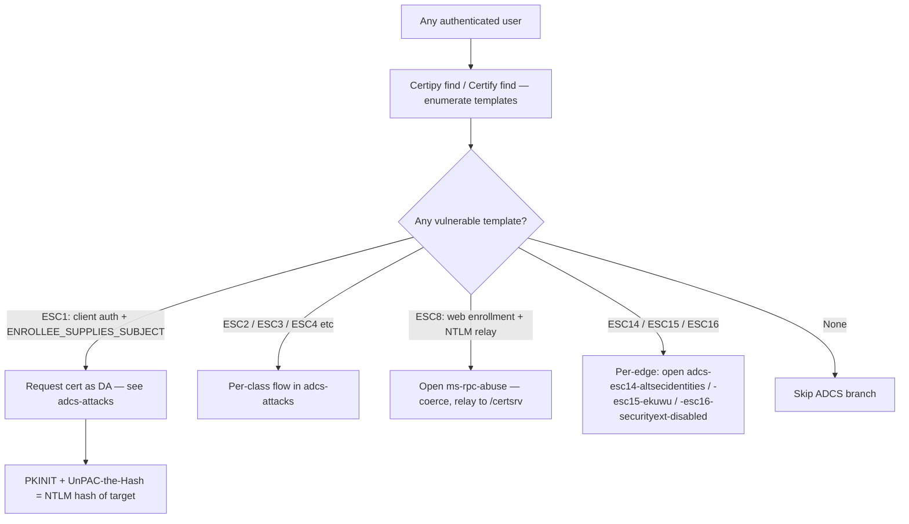
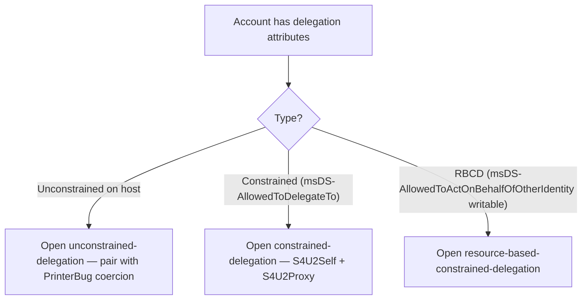
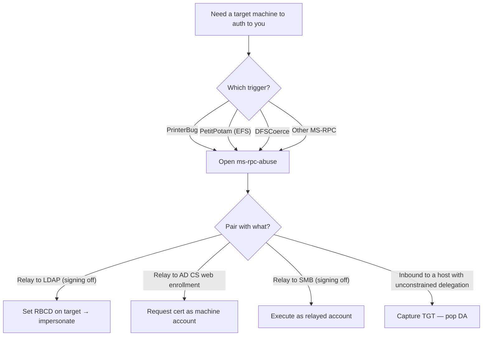
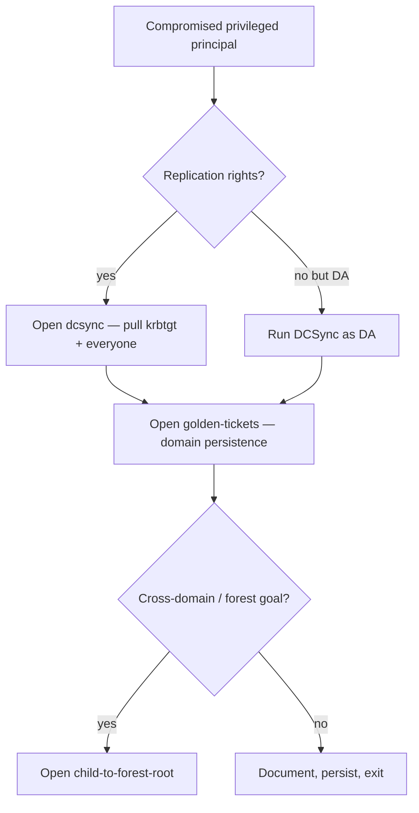
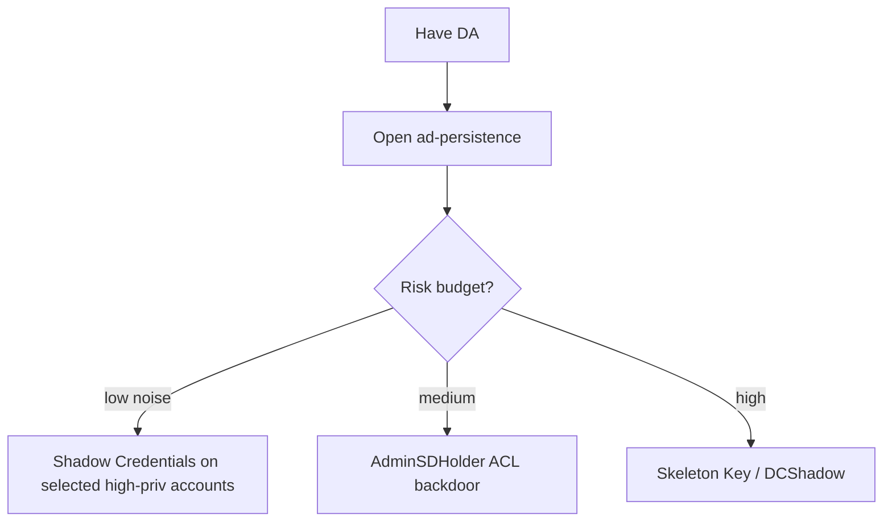

> **TL;DR.** You have a domain-user foothold. This is the canonical
> "domain user → Domain Admin" decision tree. Most internal pentests
> and most AD-themed CTFs walk this graph.

## Top-level path

## Pre-creds primitives (you have a username but no password)

## SPN / kerberoasting

## ACL abuse (BloodHound-visible)

## AD CS — the certificate path (very common)

## Delegation abuse

## Coerced auth (no creds for the target, just network reachability)

## Reaching DA / DCSync

## Persistence (only when in scope)

## Where to go next

- DA achieved → goal of most internal engagements; document and clean
  up per scope rules.
- DA in child, want forest → [[child-to-forest-root]].
- Want low-noise variant → [[ad-recon-low-noise]] +
  [[opsec-fundamentals]].
- Want to chain to cloud (Entra hybrid) →
  [[entra-connect-exploitation-2025]] →
  [[cloud-foothold-playbook]].

## Anti-patterns

- Running default SharpHound options on monitored environments
  (`-c All` is loud — use `-c Group,LocalGroup,Session,Trusts` or
  similar for opsec).
- Spraying passwords without checking the lockout policy first.
- Running Mimikatz unencoded on a host with Defender enabled in 2026.
