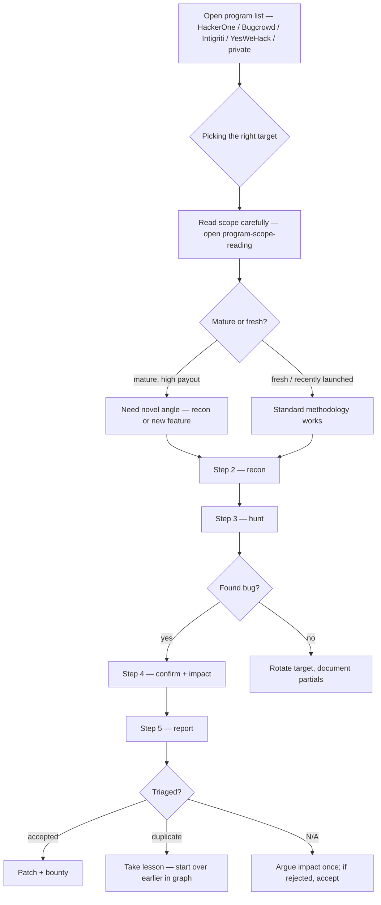
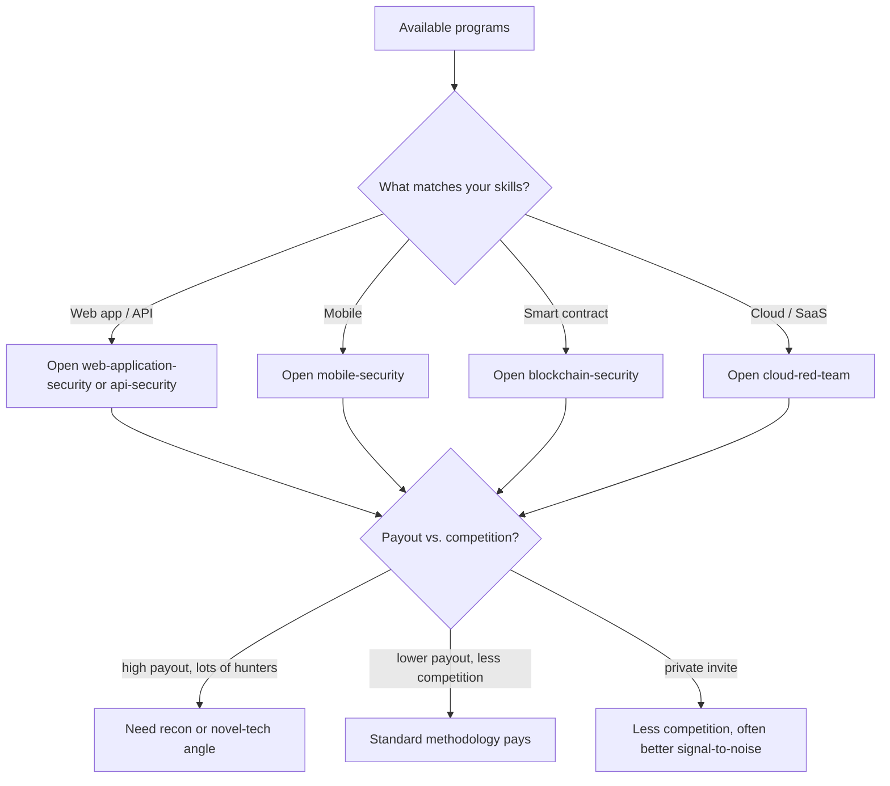
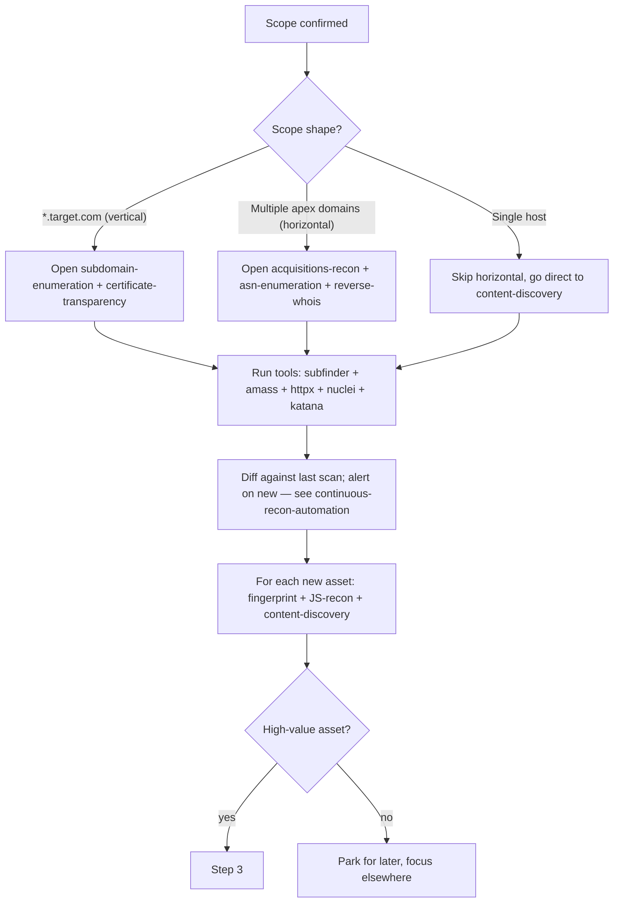
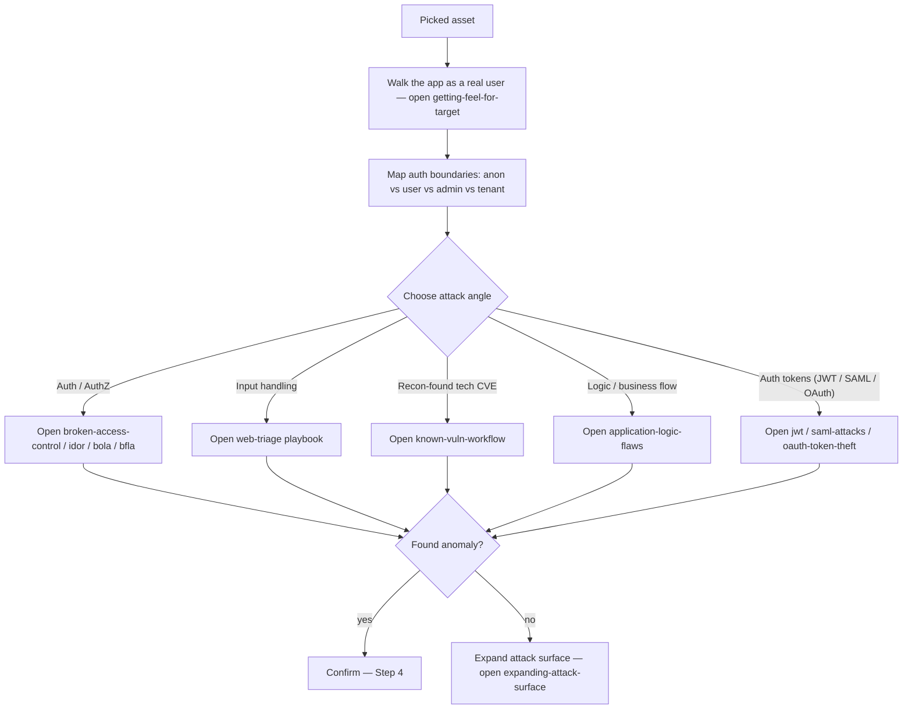
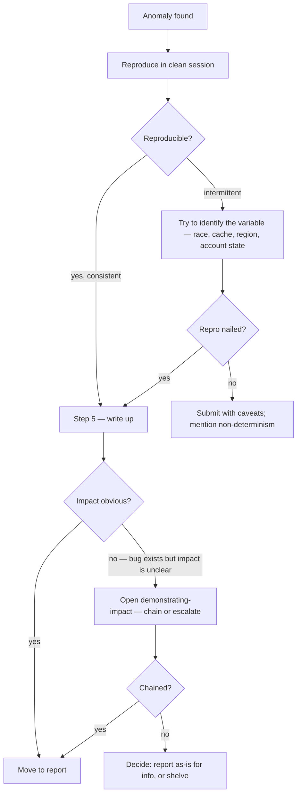
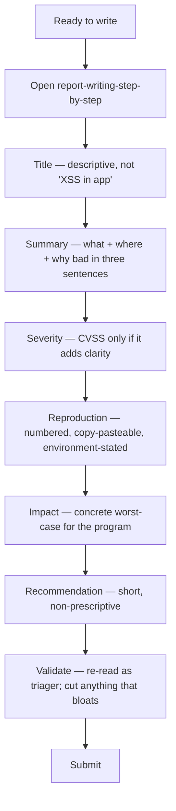
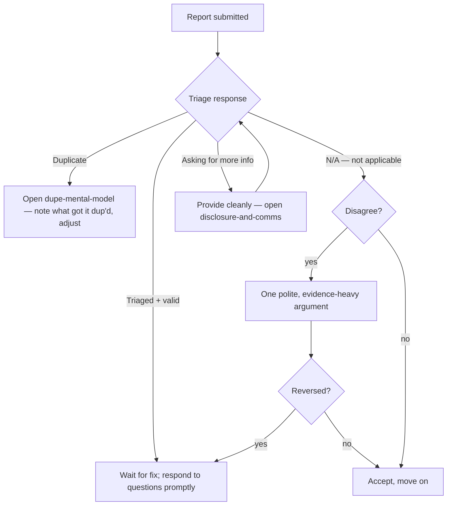
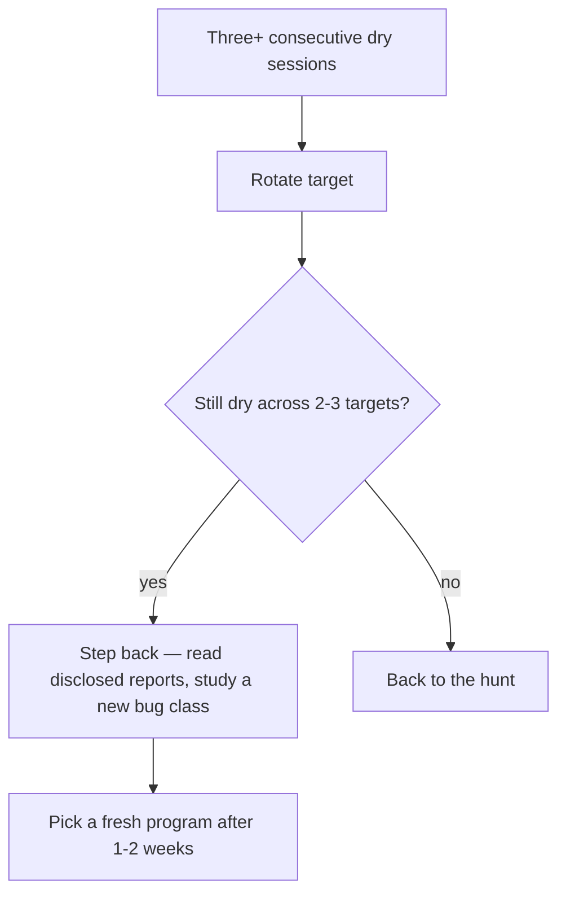

> **TL;DR.** Bug bounty is a pipeline, not a search. This playbook
> takes you from program-list to paid report, with the decision
> points where most hunters lose hours.

## End-to-end flow

## Step 1 — picking the right program

## Step 2 — recon

## Step 3 — hunt

## Step 4 — confirm and demonstrate impact

## Step 5 — report

## After submission

## Burnout / pipeline management

## Anti-patterns

- Skipping scope reading and submitting an out-of-scope finding.
- Spamming low-impact reports for volume; reputation tanks fast.
- Chasing 0-days when basic auth-z testing pays better.
- Re-reading the same WAHH chapter instead of testing.
- Not keeping recon delta — you re-discover yesterday's subdomains
  every time.

## Where to go next

- Methodology depth → [[bug-bounty-methodology]].
- Specific bug class → [[web-triage]] picks the lane.
- Engagement-level mental model → [[bug-bounty-index|bug bounty
  topics]].
