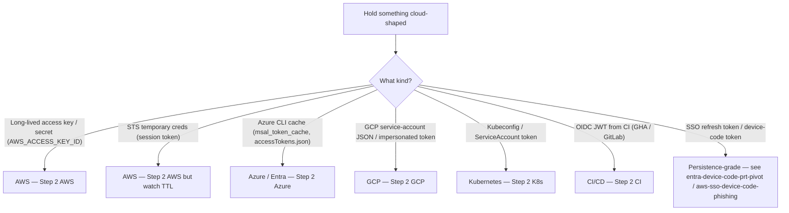
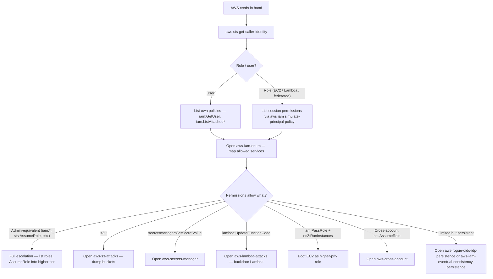
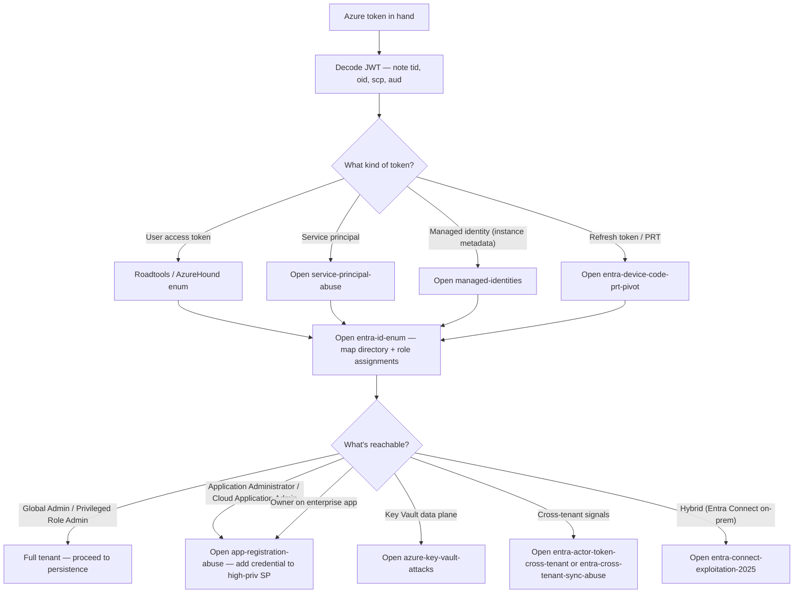
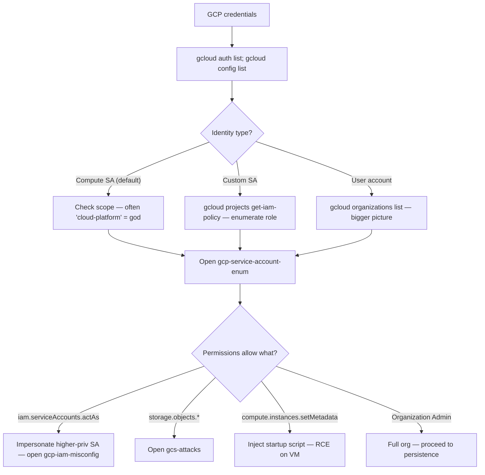
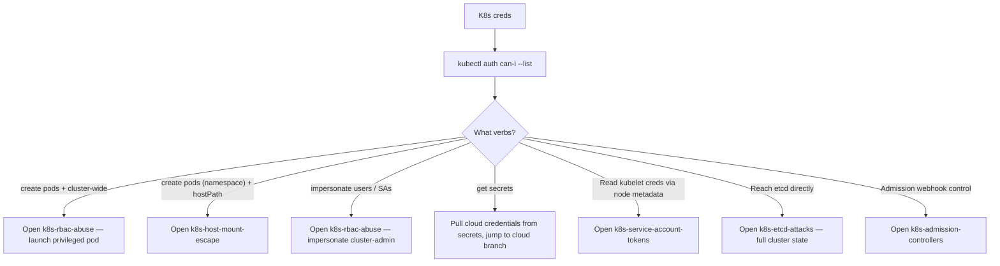
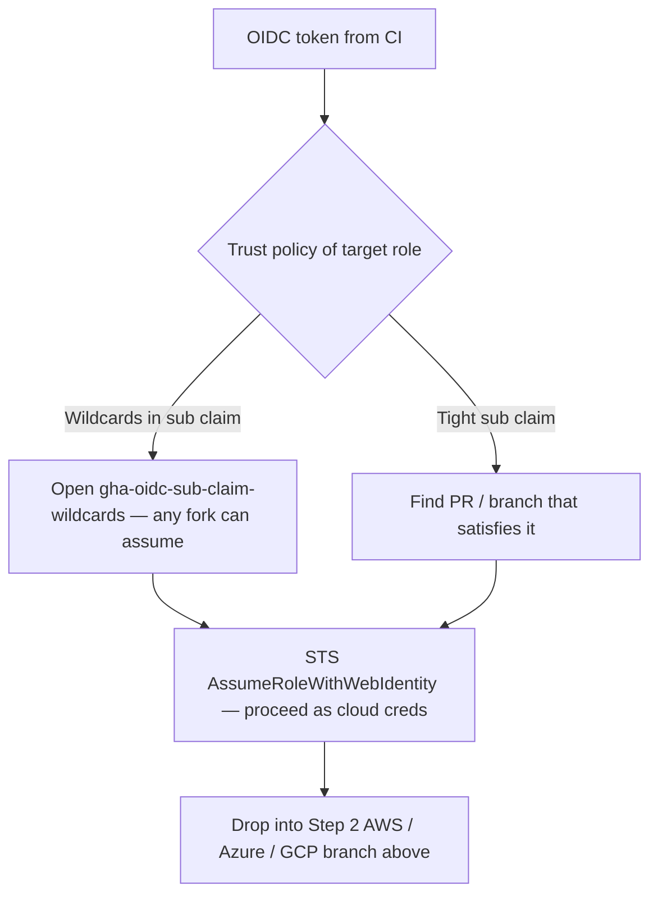
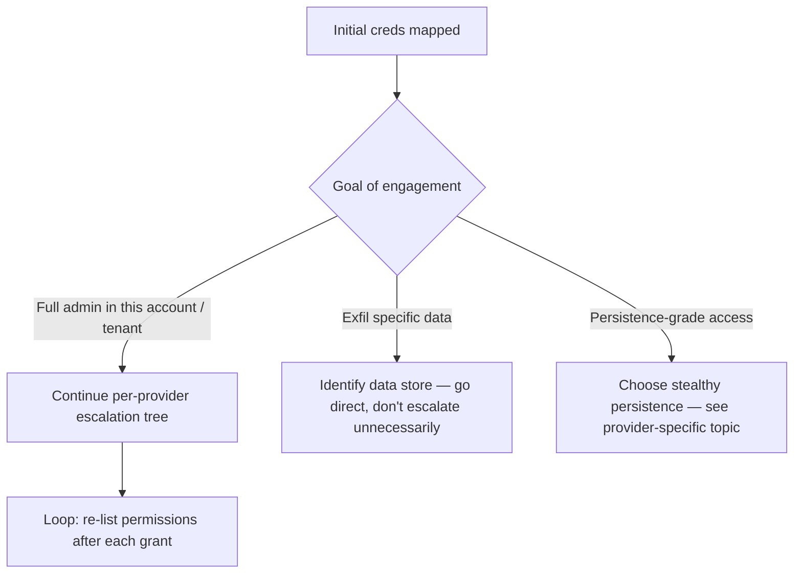
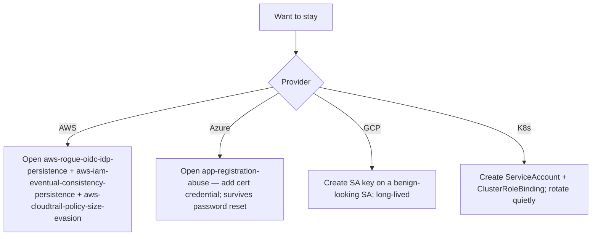

> **TL;DR.** You have cloud credentials, a managed-identity token, a
> CI/CD secret, or a session token. This playbook picks the next
> move per provider and stops you from wasting calls on the wrong
> service.

## Step 1 — identify what you have

## Step 2 AWS — what role am I?

## Step 2 Azure / Entra — what tenant and identity?

## Step 2 GCP — service account or human?

## Step 2 Kubernetes — pod or external?

## Step 2 CI/CD OIDC

## Step 3 — escalate or pivot

## Step 4 — persistence (in-scope only)

## Detection-aware notes

- AWS CloudTrail catches almost everything by default — see
  [[aws-cloudtrail-policy-size-evasion]] for the modern evasion
  surface.
- Entra unified audit log covers most plane calls but has known
  gaps on cross-tenant; see [[entra-actor-token-cross-tenant]].
- GCP audit logs default off on data-plane reads — exfil through
  GCS / BigQuery is quieter than the equivalent on AWS.
- K8s audit log is opt-in per cluster; assume it's off.

## Anti-patterns

- Calling `iam:ListUsers` / `iam:ListRoles` on a 10k-user account
  with no rate-limit — instant detection.
- Running ScoutSuite / Pacu / Prowler full-scan against a target
  account — fine in your own lab, loud in a real engagement.
- Assuming Azure CLI tokens are short-lived — refresh tokens last
  90 days by default.

## Where to go next

- Got admin → [[cloud-red-team]] path for persistence + opsec.
- Got K8s admin → consider whether you also want host node access
  (see [[k8s-host-mount-escape]]).
- Got AD CS / Entra hybrid surface → swing back to
  [[ad-attack-path-playbook]].
