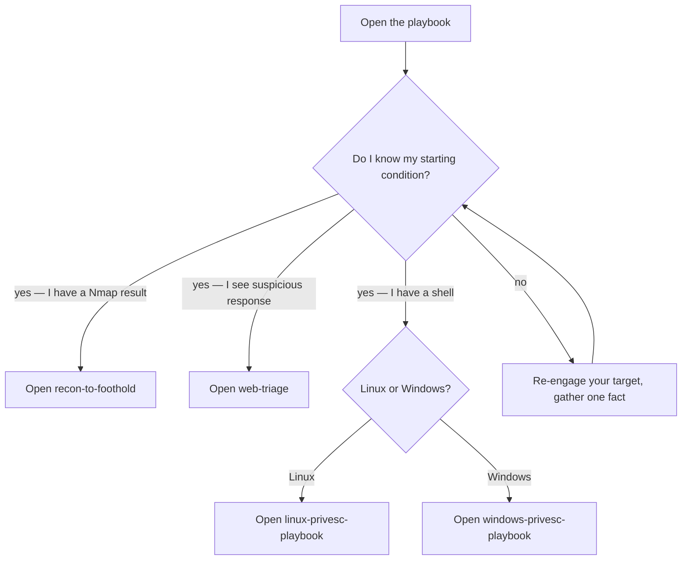

> **TL;DR.** When you're stuck — "I scanned, now what?", "I see this
> bug, how do I prove impact?", "I have a shell, how do I escalate?"
> — these decision trees pick the next move. They aren't substitutes
> for the topic notes; they tell you *which* topic note to open.

## Why playbooks

The hub's [[topics-index|topic notes]] are atomic — one technique per
page. That's great for lookup, terrible when you don't know what
you're looking for. Playbooks fill the gap with branching decision
diagrams that go from a real-world starting condition to a concrete
next action.

Use them when:

- You ran a scan and don't know what to triage first.
- You see a request / response pattern and aren't sure what bug class
  it points at.
- You have a foothold and need to pick the lowest-risk path to the
  next tier.
- You're prepping for a bug-bounty engagement, an exam, or a real
  internal engagement and want a checklist you can fall back to under
  time pressure.

## The playbooks

- [[recon-to-foothold|Recon → foothold]] — "I have an Nmap result;
  per service, what's the next move?"
- [[web-triage|Web bug-class triage]] — "I see this in the response
  or this in the request; what bug am I looking at?"
- [[linux-privesc-playbook|Linux privesc decision tree]] — "I have a
  Linux shell; how do I escalate?"
- [[windows-privesc-playbook|Windows privesc decision tree]] — "I
  have a Windows shell; how do I escalate?"
- [[ad-attack-path-playbook|Active Directory attack path]] — "I have
  a domain-user foothold; how do I reach Domain Admin?"
- [[lateral-movement-playbook|Lateral movement decisions]] — "I have
  credentials or a hash; which lateral primitive should I use?"
- [[bug-bounty-workflow|Bug-bounty workflow]] — "Program picked, now
  what?"
- [[cloud-foothold-playbook|Cloud foothold playbook]] — "I have AWS
  / Azure / GCP credentials or a token; what's the escalation
  surface?"
- [[oscp-full-chain-walkthrough|OSCP-shaped full chain]] — worked
  example from external recon to Domain Admin, OSCP-exam pacing.
- [[osep-full-chain-walkthrough|OSEP-shaped full chain]] — worked
  example from phishing to cross-forest DA under EDR-on conditions.
- [[secure-sdlc-rollout-playbook|Secure-SDLC rollout]] — six-wave
  sequence to roll out a secure SDLC without burning team goodwill.

## How to read a playbook

Each diagram is a **decision tree**, not a checklist. Follow the
branch that matches your situation. Boxes that name a `[[topic]]`
mean "open that note for the technique". Boxes that name a tool
mean "this is the canonical tool — see [[tools]]". Diamonds are
decision points.

If you ever find yourself running every branch in parallel, you're
not triaging — you're spraying. Pick the branch that matches your
target's posture and your time budget.

## A sample decision tree

When the diagram tells you to open a topic note, that's where the
how-to lives. Playbooks tell you *which* note. The notes tell you
*how*.
