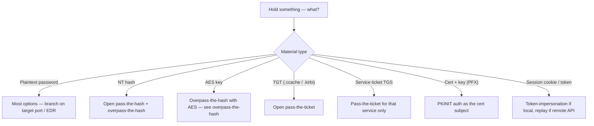
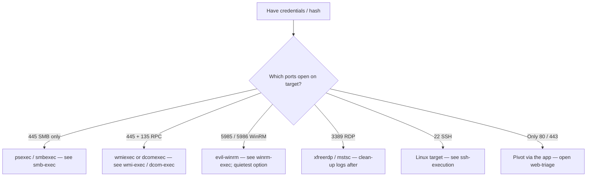
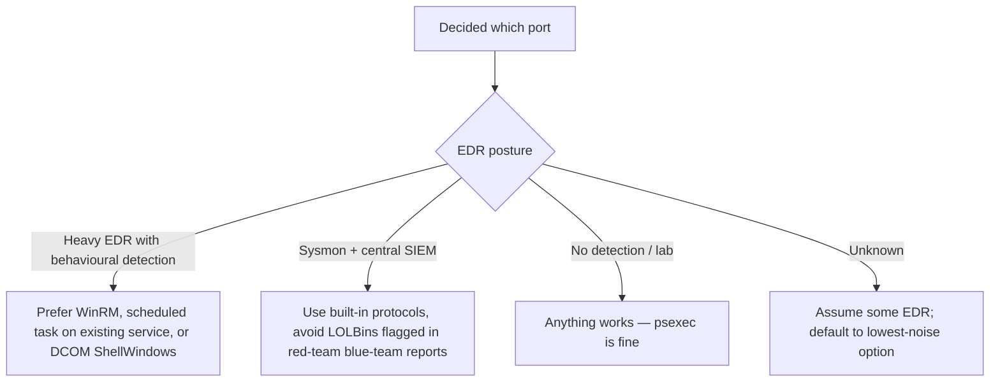
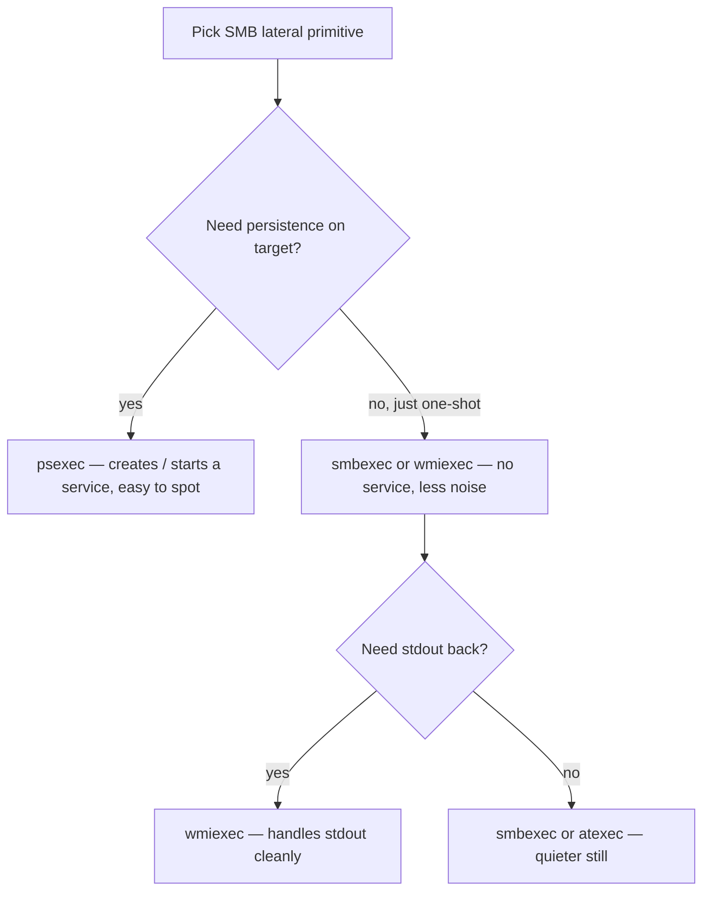
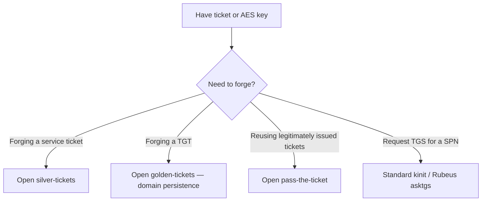
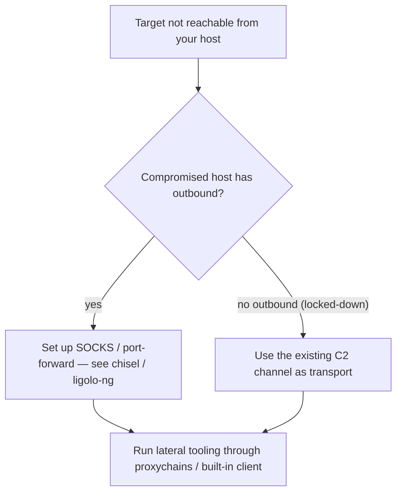
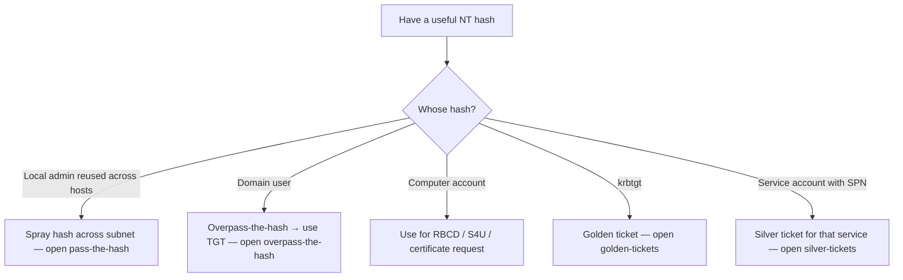
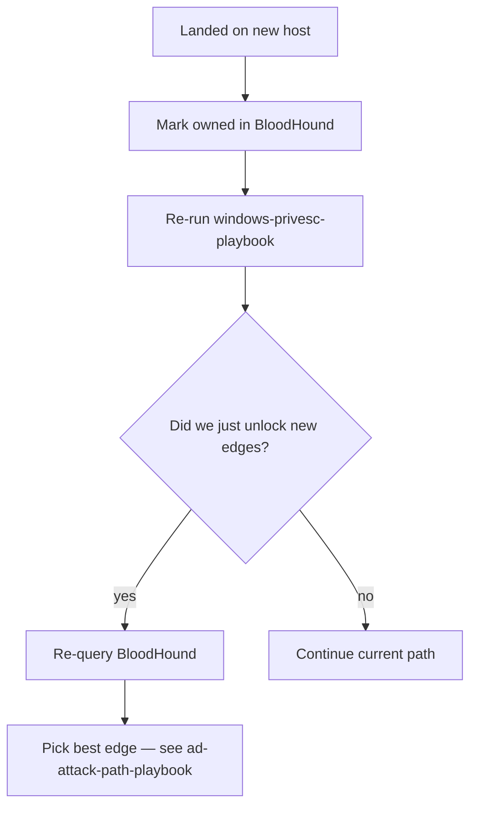

> **TL;DR.** You have credentials, a hash, a ticket, or a session.
> The wrong lateral primitive gets you caught. This playbook picks
> the lowest-noise primitive your material and target allow.

## What's in your hand?

## Pick by target port

## Pick by detection budget

## Decision: SMB-exec family

## Decision: Kerberos (use a ticket / hash)

## Decision: pivot through compromised host

## Hash-to-DA shortcut tree

## After arrival

## Anti-patterns

- Hammering the same host with five lateral tools in a row — first
  succeeded tool is what defenders see; pick one.
- Using local-admin password sprays in 2026 environments with LAPS
  enabled (waste of time and noisy).
- Running Mimikatz on a host you intend to leave clean — dump LSASS
  remotely from your beacon instead.
- Forgetting to revoke / clean up scheduled tasks / service stubs
  you created.

## Where to go next

- Each lateral primitive has a topic note — open it for syntax.
- Got DA → [[ad-attack-path-playbook]] for persistence and forest
  reach.
- Got cloud token instead → [[cloud-foothold-playbook]].
