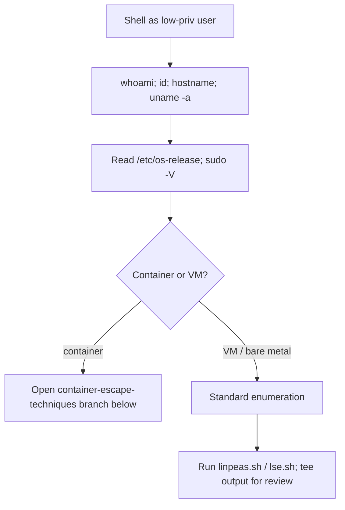
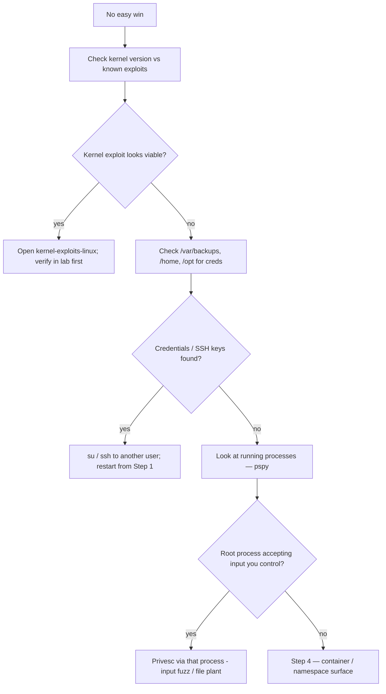
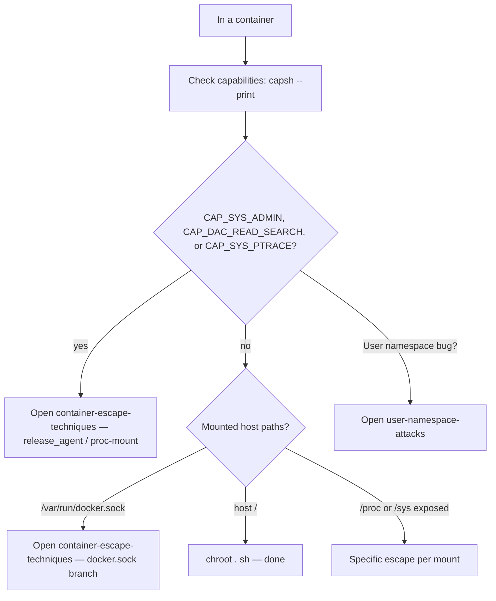
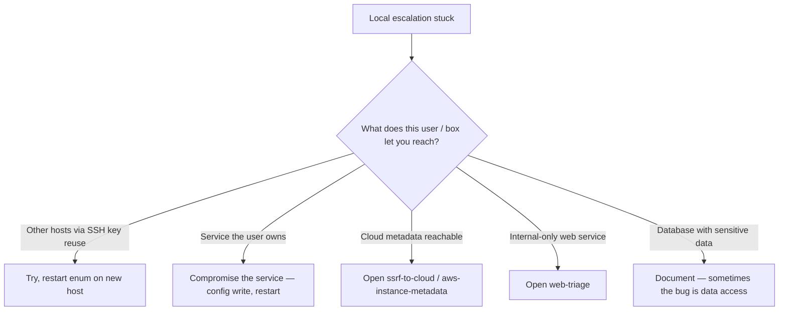

> **TL;DR.** You have a Linux shell. This playbook turns the
> usually-overwhelming linpeas / lse output into a sequenced decision
> tree.

## Step 1 — orient



## Step 2 — easy wins first

```mermaid
flowchart TD
    A[Enum results in hand] --> B{Any of these true?}
    B -- "sudo -l shows ANY entry" --> C[Open sudo-misconfig]
    B -- "SUID binaries with GTFOBins entry" --> D[Open suid-sgid-binaries]
    B -- "Writable /etc/passwd or /etc/shadow" --> E[Open writable-passwd-shadow — instant root]
    B -- "User in 'docker' / 'lxd' / 'disk' / 'shadow' group" --> F[Group → root path; see [[linux-privesc-vectors]]]
    B -- "Cap-listed binary with cap_setuid+ep or cap_dac_read+ep" --> G[Open capabilities-privesc]
    B -- "Mounted NFS no_root_squash share" --> H[Open nfs-no-root-squash]
    B -- "Writable cron / systemd / init script as root" --> I[Open cron-jobs]
    B -- "LD_PRELOAD env_keep in sudoers" --> J[Open ld-preload-abuse]
    B -- "World-writable directory on root's PATH" --> K[Open path-hijacking]
    B -- "None of the above" --> L[Step 3 — harder paths]
```

## Step 3 — harder paths



## Step 4 — container / namespace escape



## Step 5 — pivot, don't escalate

If you can't root the box, sometimes the foothold is enough.



## Where to go next

- Got root → [[linux-enumeration]] for post-ex (creds, persistence).
- Got pivot creds → restart at Step 1 on the next host.
- Stuck and time-boxed → write up what you found; partial wins still
  count.

## Anti-patterns

- Reading 40 GTFOBins entries before running `sudo -l`.
- Compiling a kernel exploit without a matching lab kernel first.
- Running aggressive enumeration scripts when the host has EDR — see
  [[ad-recon-low-noise]] for the principle.
