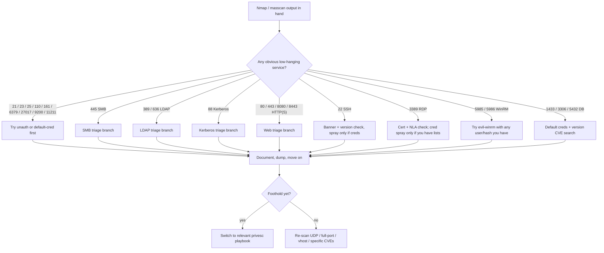
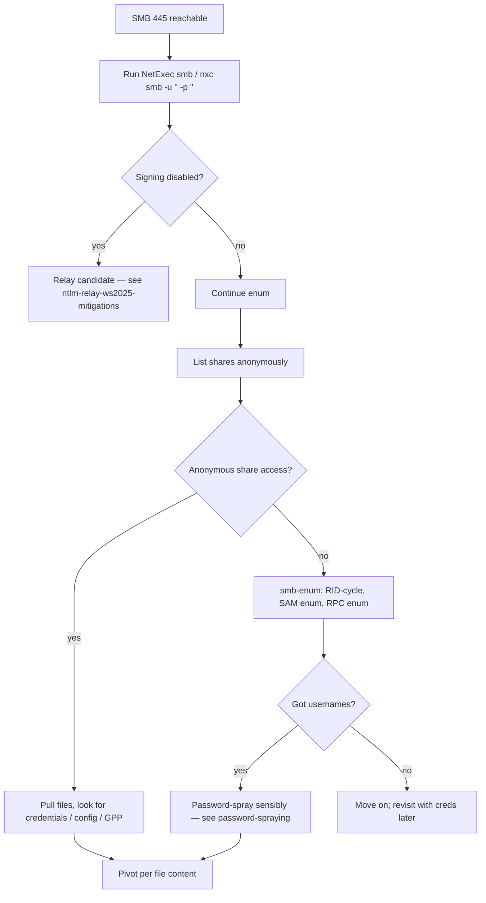
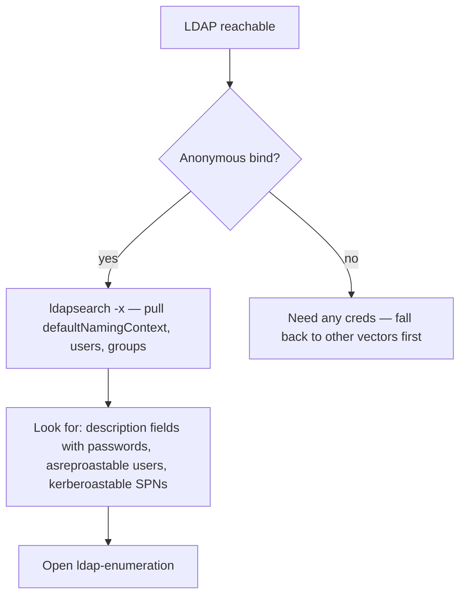
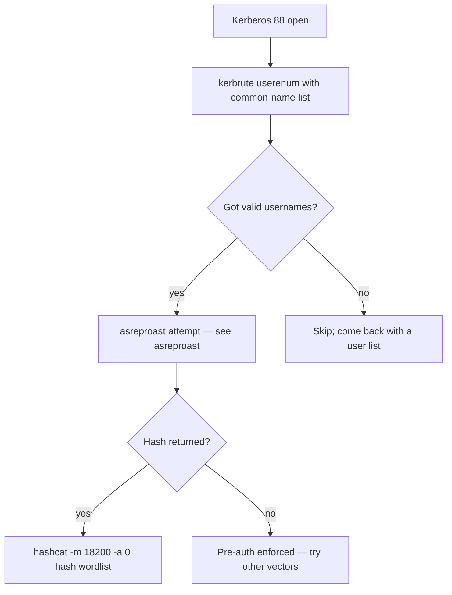
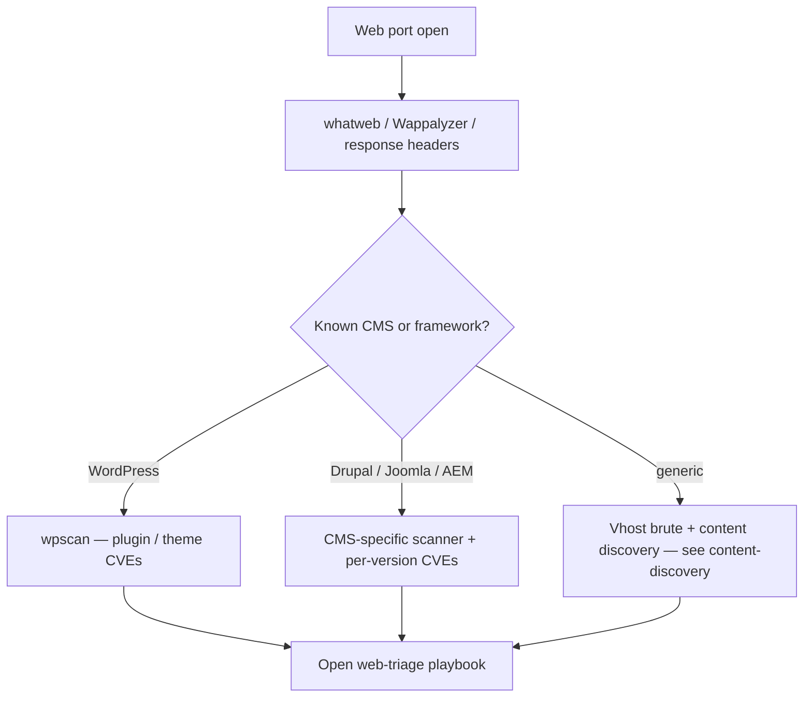
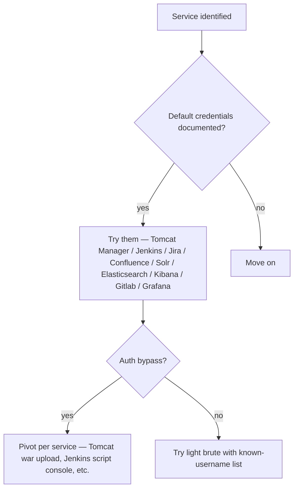
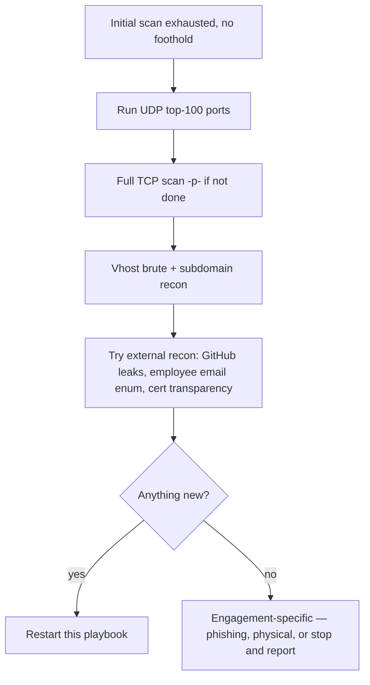

> **TL;DR.** You ran a scan. Some ports came back. This playbook
> picks the next move per service so you spend time on the things
> most likely to give a foothold.

## Top-level flow

## SMB branch (445 open)

## LDAP branch (389/636 open)

## Kerberos branch (88 open)

## Web branch (80/443/8080/8443 open)

## Default-creds quick wins (multiple ports)

## When nothing works

## Where to go next

- Got SMB foothold → [[windows-privesc-playbook]] or
  [[ad-attack-path-playbook]] depending on environment.
- Got web shell → [[linux-privesc-playbook]] usually.
- Got domain-user creds → [[ad-attack-path-playbook]].
- Got nothing — restart with broader recon, see [[bug-bounty-workflow]]
  for the methodology angle.
