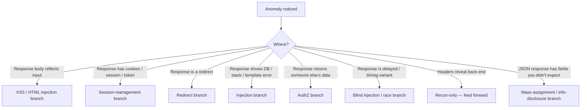
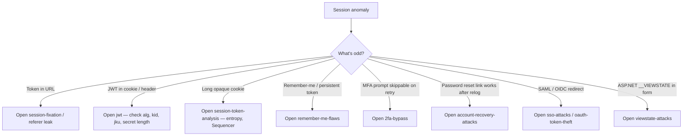
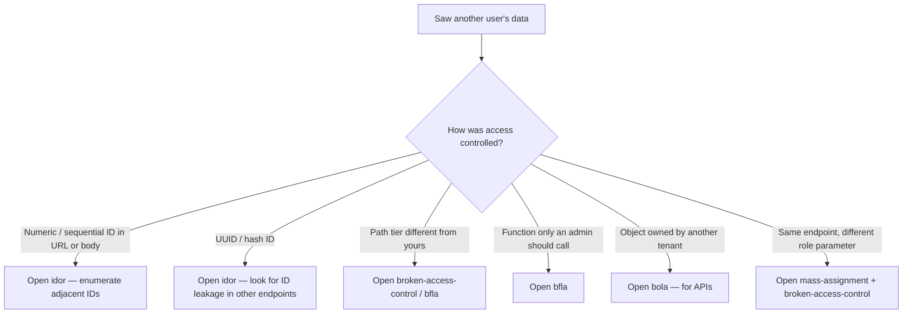
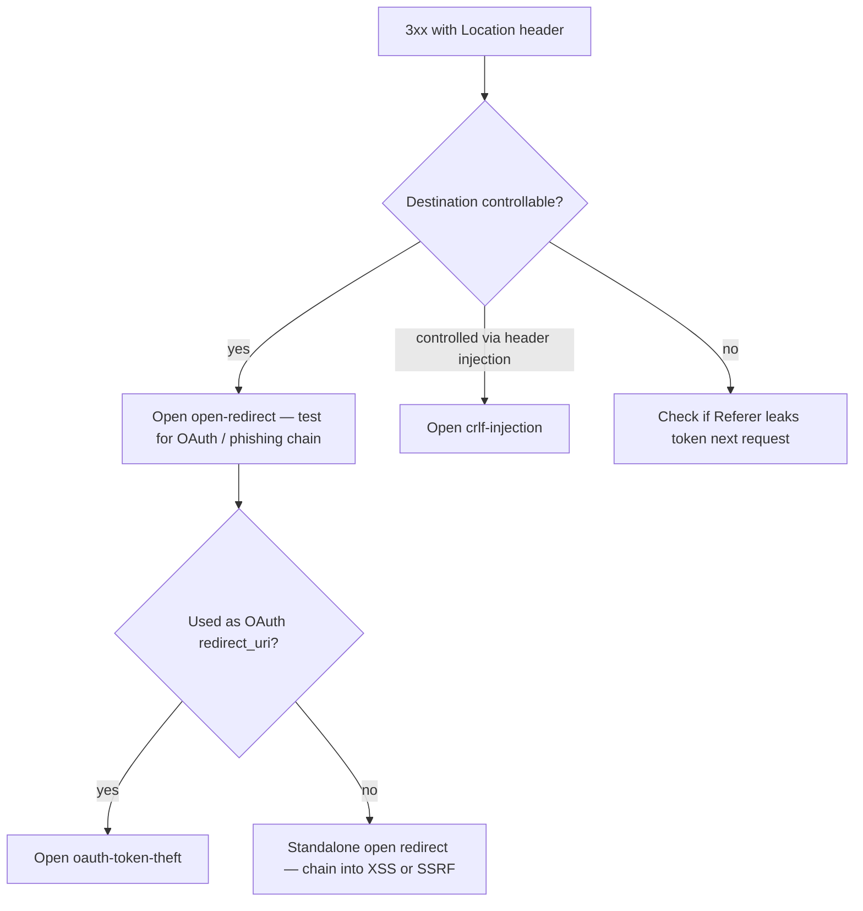
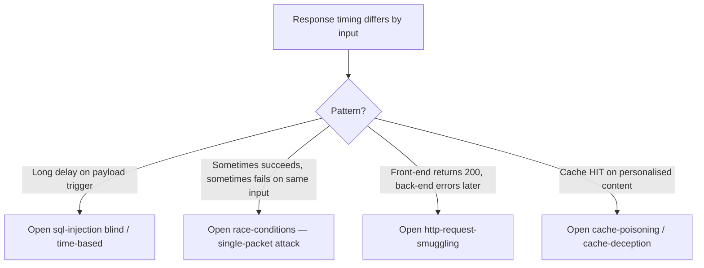
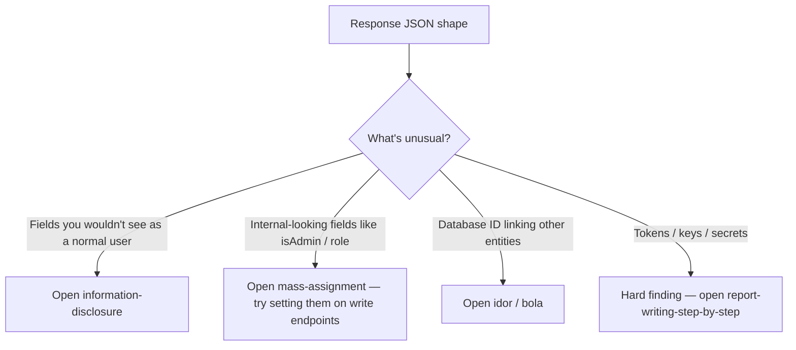
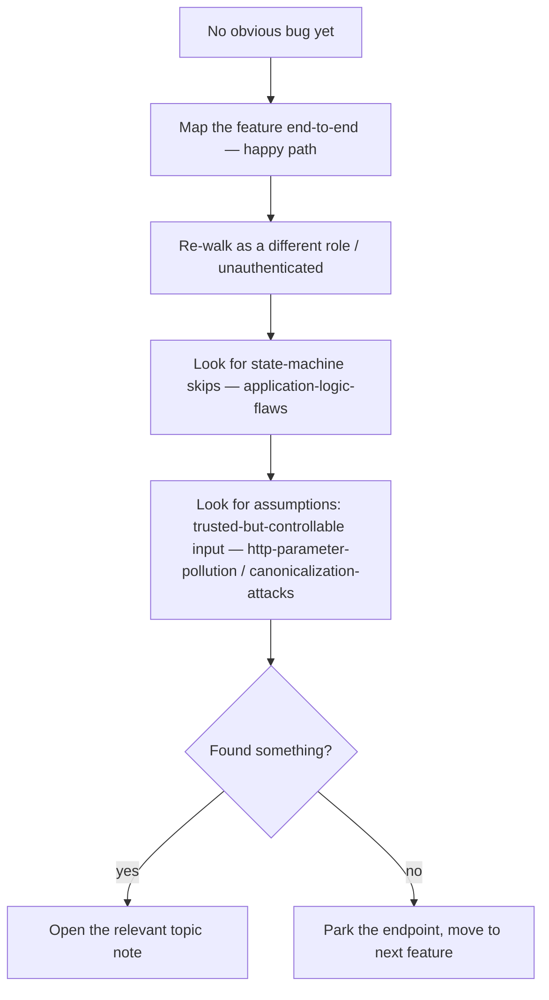

> **TL;DR.** You're looking at a request/response and something
> feels off. This playbook maps the observation to the most likely
> bug class so you stop guessing and start probing the right thing.

## Where do you see the anomaly?



## Reflected input → XSS / HTML injection

```mermaid
flowchart TD
    A[Input reflects in response] --> B{Where in the response?}
    B -- "HTML body, between tags" --> C[Try <svg onload=alert(1)>]
    B -- "HTML attribute value" --> D["Try \" autofocus onfocus=alert(1) //"]
    B -- "JavaScript context" --> E["Try ';alert(1);// and template-literal break"]
    B -- "URL / href attribute" --> F[Try javascript: + open-redirect]
    B -- "CSS / style attribute" --> G[Try expression() or @import — see css-injection-exfiltration]
    C --> Z{Script executes?}
    D --> Z
    E --> Z
    F --> Z
    G --> Z
    Z -- yes --> AA[Open cross-site-scripting]
    Z -- no --> AB{Encoded but reflects?}
    AB -- yes --> AC[Try alternate encodings / sanitiser confusion]
    AB -- no --> AD[Open html-injection — still impact via dangling markup]
```

## Database / template error visible

```mermaid
flowchart TD
    A[Error message reveals stack] --> B{Error type}
    B -- "SQL syntax" --> C[Open sql-injection — confirm with ' and union]
    B -- "NoSQL operator error" --> D[Open nosql-injection — try $ne, $regex]
    B -- "Template engine error: Jinja / Twig / ERB / Velocity / Freemarker" --> E[Open ssti — try {{7*7}}]
    B -- "XML parser error" --> F[Open xxe — try external entity]
    B -- "JSON deserialiser error" --> G[Open deserialisation — pick stack]
    B -- "OS command output / shell error" --> H[Open command-injection]
    B -- "Path / file not found" --> I[Open lfi-rfi / path-traversal]
```

## Auth / session weirdness



## Returns someone else's data → AuthZ



## Redirect responses



## Delays / timing weirdness



## JSON has unexpected fields



## When you've ruled the obvious classes out



## Where to go next

- Confirmed bug class → open the matching topic note for proof-of-concept patterns.
- Need impact for the report → [[demonstrating-impact]] and [[report-writing-step-by-step]].
- Lost in scope → [[bug-bounty-workflow]].
