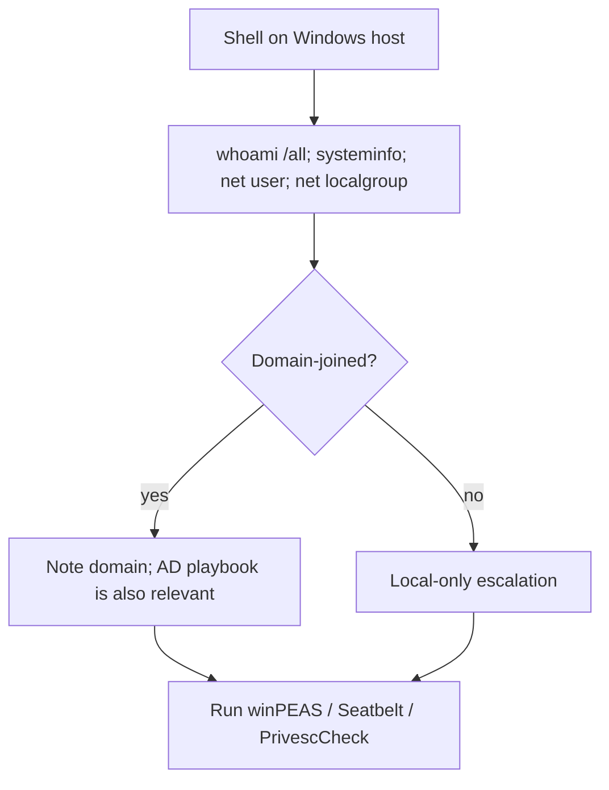
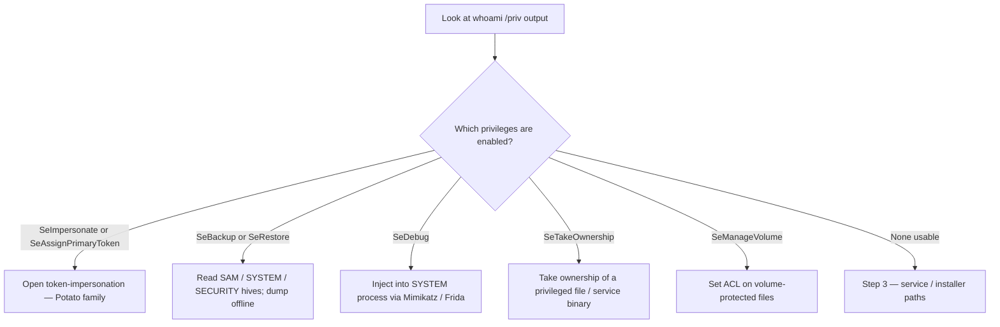
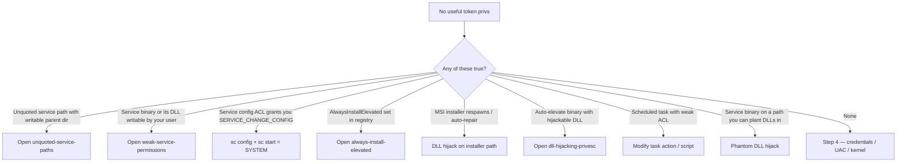
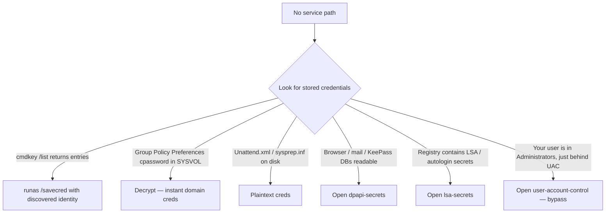
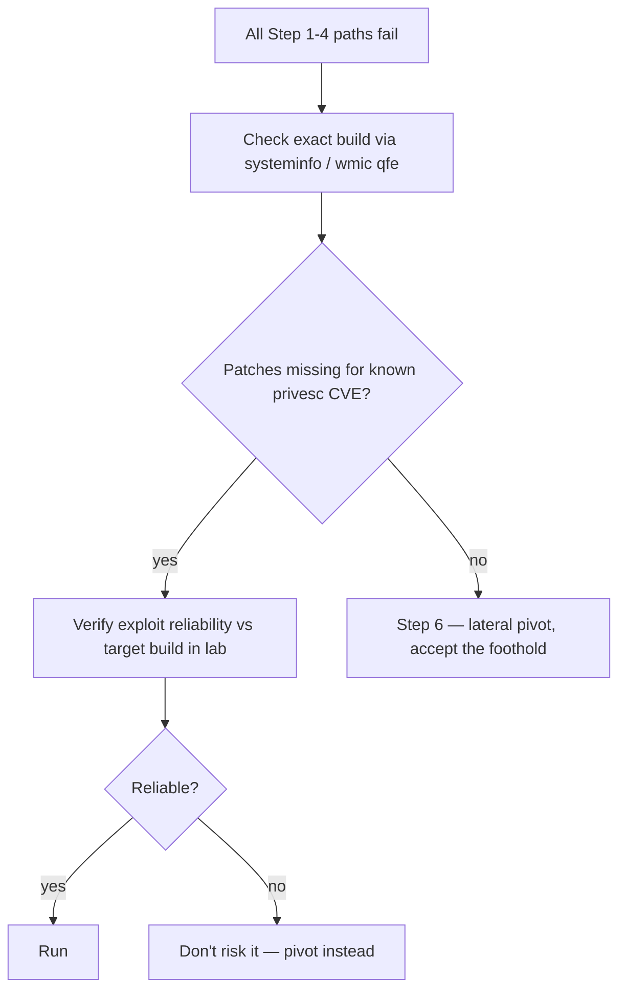
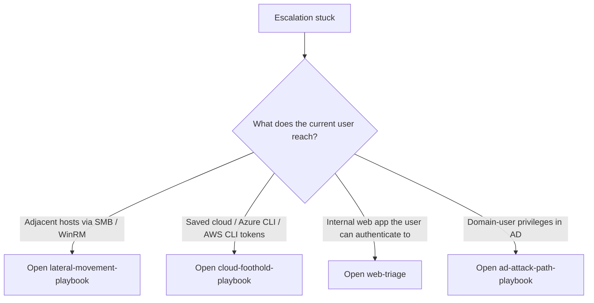

> **TL;DR.** You have a Windows shell. This playbook turns the
> usually-overwhelming winPEAS / Seatbelt output into a sequenced
> decision tree, with the modern token / service / installer paths
> ordered by likelihood.

## Step 1 — orient

## Step 2 — token / privilege checks

## Step 3 — services and installers

## Step 4 — credentials and UAC

## Step 5 — kernel and unpatched CVEs

## Step 6 — pivot, don't escalate

## Where to go next

- Got SYSTEM → [[credential-dumping]] (LSASS, SAM, DPAPI, NTDS via
  Backup priv).
- Got SYSTEM in AD → straight to [[ad-attack-path-playbook]] step
  "from local admin to DA".
- Stuck → consider whether the box is worth more time vs lateral
  pivot.

## Detection-aware notes

- LSASS dumping via comsvcs / direct read is the loudest signal you
  can emit on a modern EDR — defer if the engagement has detection
  goals; see [[edr-hooks-and-unhooking]].
- Loading nimble UAC bypasses on hosts with WDAG enabled is wasted
  effort; check `wmic os get OSArchitecture, BuildNumber` first.
